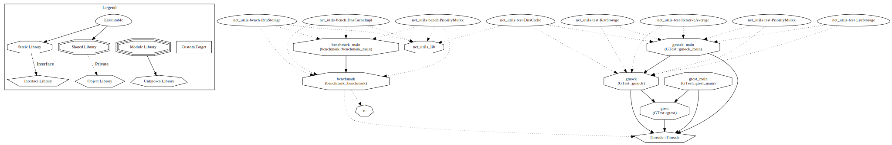

### Тестовое по [вакансии](https://hh.ru/vacancy/110746454).

* Синопсис [problem.txt](problem.txt). <br/>
* Реализация в [DnsCacheImpl.hpp](net_utils/DnsCacheImpl.hpp). <br/>
* [Singleton facade](net_utils/Singleton.hpp) для него в [DnsCache.hpp](net_utils/DnsCache.hpp). <br/>
* Кеш использует идиому [LRU](https://en.wikipedia.org/wiki/Cache_replacement_policies#LRU). <br/>
* По результатам [замеров](bench_results/Cache.txt) производительность на синхронизации лучше с std::mutex. <br/>
* [Параметризация сборки](#Параметризация-сборки)

<details>
<summary><font size="-1">Целевой тест собирается и запускается командой:</font></summary>

```
SRC="$(pwd)"; BUILD=/tmp/nut_build;  cmake "$SRC" -B "$BUILD" -DCMAKE_BUILD_TYPE=Release && cmake --build "$BUILD" --target net_utils-test-DnsCache --parallel $(nproc) && "$BUILD/net_utils/tests/net_utils-test-DnsCache"
```
</details>


Big O для итоговой реализации:

* resolve - O(1)
* update - O(1) в случае без коллизии хеша и O(size(url)) в ином.

<details>
<summary><font size="-1">Research</font></summary>

* В результатах бенчмарка фигурирует реализация кеша с [RCU](https://en.wikipedia.org/wiki/Read-copy-update) идиомой.
Значительно проигрывает, тк не удалось решить проблему необходимости полной копии при изменении эпохи. <br/>
* Реализован и противопоставлен std::mutex [PriorityMutex.hpp](net_utils/PriorityMutex.hpp). Работает
как [spinlock](https://en.wikipedia.org/wiki/Spinlock) c приоритетом на эксклюзивную блокировку. Оказался хуже std::
mutex при больших количествах потоков.
* [LruStorageLockFree.hpp](net_utils/LruStorageLockFree.hpp) содержится недоведенная реализация lock-free LRU. 
Потенциально быстрее текущей версии LRU с блокировками.
* Для тестов бенчмарков используется набор из [aux](net_utils/aux). Предоставляет шаблонные fixture для манипуляций с объектами из нескольких потоков. 
</details>

<details>
<summary><font size="-1">Собрать и запустить все тесты можно командой:</font></summary>

Выполнять из папки проекта.
```
SRC="$(pwd)"; BUILD=/tmp/nut_build; cmake "$SRC" -B "$BUILD" -DCMAKE_BUILD_TYPE=Release && cmake --build "$BUILD" --target net_utils_build_all_test --parallel $(nproc) && ctest --test-dir "$BUILD" --extra-verbose --parallel $(nproc)
```
</details>

#### Параметризация сборки

`-DNET_UTILS_DNS_CACHE_REC_LIMIT=<uint>` Размер кеша по умолчанию. <br/>
`-DBUILD_TESTING=<ON|OFF>` Сборка тестов. Стандартная переменная cmake. <br/>
`-DNET_UTILS_RESEARCH=<ON|OFF>` Сборка benchmark`ов. <br/>

<details>
<summary><font size="-1">Вспомогательные параметры сборки</font>.</summary>


`-DNET_UTILS_GTEST_VERSION=<version from ghub>` <br/>
`-DNET_UTILS_GBENCH_VERSION=<version from ghub>` <br/>
`-DNET_UTILS_RESEARCH_GBENCH_SAN=<ON|OFF>` <br/>
`-DNET_UTILS_SANITIZERS="[[address];[thread];[ub];[leak];[mem]]"` <br/>
По умолчанию для всех тестов в [tests](net_utils/tests) создается target с санитайзерами из списка.
</details>

[Список целей](gifs/targets.svg): <br/>

Проект собирался и тестировался на:
* GNU C++17 (Ubuntu 10.5.0-1ubuntu1~22.04) version 10.5.0 (x86_64-linux-gnu)
* clang -cc1 version 19.1.1 based upon LLVM 19.1.1 default target x86_64-unknown-linux-gnu
* GNU C++17 (GCC) версия 14.2.0 (x86_64-pc-linux-gnu)

Проект зависит только от libc++ | libstdc++ и сопутствующих им библиотек. <br/>
Разрешение других зависимостей происходит автоматически с помощью [cmake-CPM](https://github.com/cpm-cmake/CPM.cmake).

© Весь код (c++/cmake), представленный в репозитории, так или иначе, написан [мной](https://github.com/conelov).
Некоторый код мог быть взят из [CustomHelper](https://github.com/conelov/CustomHelper). <br/>
В ином случае имеется аннотация на источник.